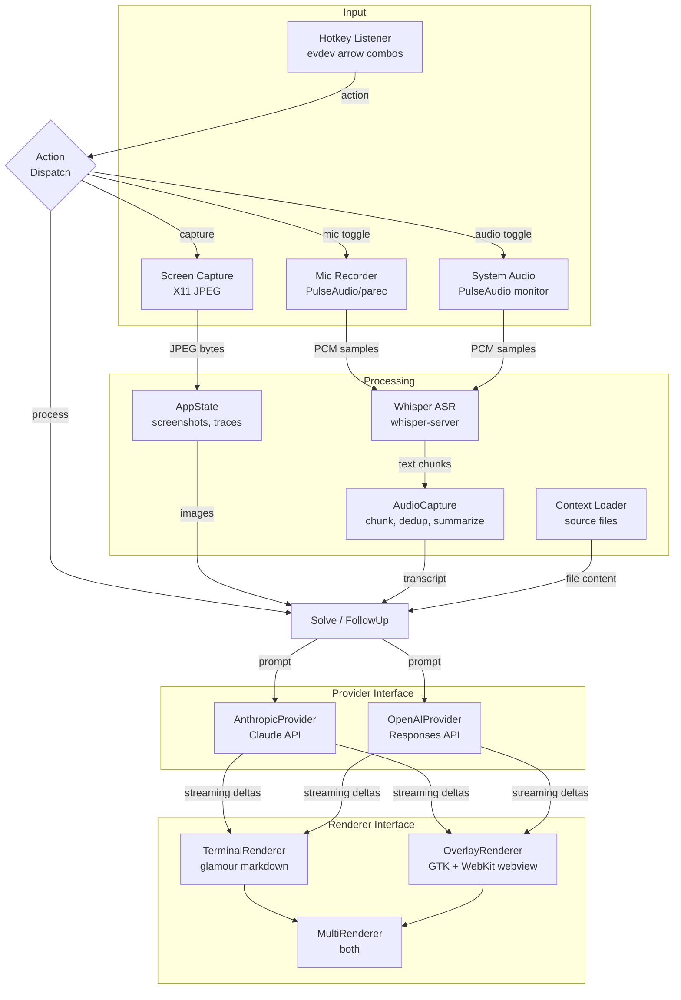

# second-nature

A multimodal AI assistant for Linux that combines screen capture, microphone/system audio transcription, and source file context. Trigger actions via global hotkeys (arrow key combos on evdev), and view streamed AI responses in the terminal or a transparent always-on-top GTK overlay with syntax-highlighted markdown.

Supports multiple AI backends (Anthropic Claude, OpenAI GPT/Codex) and multiple audio modes (mic, system audio, or both) with local Whisper ASR for transcription.

## Architecture



### Key components

| File | Role |
|---|---|
| `main.go` | CLI setup, config persistence, action dispatch loop |
| `hotkey.go` | Global hotkey listener via evdev (arrow key combos) |
| `screen_capture.go` | Screenshot capture (X11 → JPEG) |
| `asr.go` | Audio recording (PulseAudio/parec), WAV encoding, Whisper HTTP client |
| `audio_capture.go` | Continuous audio capture — chunking, silence detection, dedup, transcript summarization |
| `provider.go` | `Provider` interface + solve prompt builder |
| `solve_anthropic.go` | `AnthropicProvider` — Claude Messages API with streaming |
| `solve_openai.go` | `OpenAIProvider` — OpenAI Responses API with streaming |
| `renderer.go` | `Renderer` interface, `TerminalRenderer` (glamour), `MultiRenderer` |
| `overlay.go` | `OverlayRenderer` — GTK+WebKit transparent always-on-top webview |
| `context.go` | Source file context loading and file selection |

## Prerequisites

- Go 1.23+
- Linux / X11 (log in with "Ubuntu on Xorg" — Wayland is not supported)
- `xrandr` available in PATH
- **Overlay mode only:** `libwebkit2gtk-4.1-dev`
  ```bash
  sudo apt-get install -y libwebkit2gtk-4.1-dev
  ```

## Setup (one-time)

1. Add yourself to the `input` group (required for global hotkey):
   ```bash
   sudo usermod -aG input $USER
   ```
   Log out and back in for this to take effect.

2. If you don't want to log out, activate the group in your current shell:
   ```bash
   newgrp input
   ```

3. Create your `.env` file:
   ```bash
   cp .env.example .env
   # Edit .env and add your API key(s): ANTHROPIC_API_KEY and/or OPENAI_API_KEY
   ```

## Build & Run

```bash
make        # build
make run    # build + run
```

## Usage

1. Select a monitor by number
2. Select an AI model (Claude Opus 4.6 or GPT-5.3 Codex or GPT-5.4)
3. Select output mode (Terminal, Overlay, or Both)
4. Configure audio mode, Whisper model, and optional context directory
5. Use hotkeys to interact:

| Hotkey | Action |
|---|---|
| `←→` | Capture screenshot (stores for processing) |
| `←↓` | Toggle system audio capture |
| `↑↓` | Toggle mic recording |
| `→↓` | Process accumulated context via LLM |
| `←→↑↓` | Clear conversation history |
| `Ctrl+C` | Quit |

In overlay mode, drag the title bar to reposition the window.
